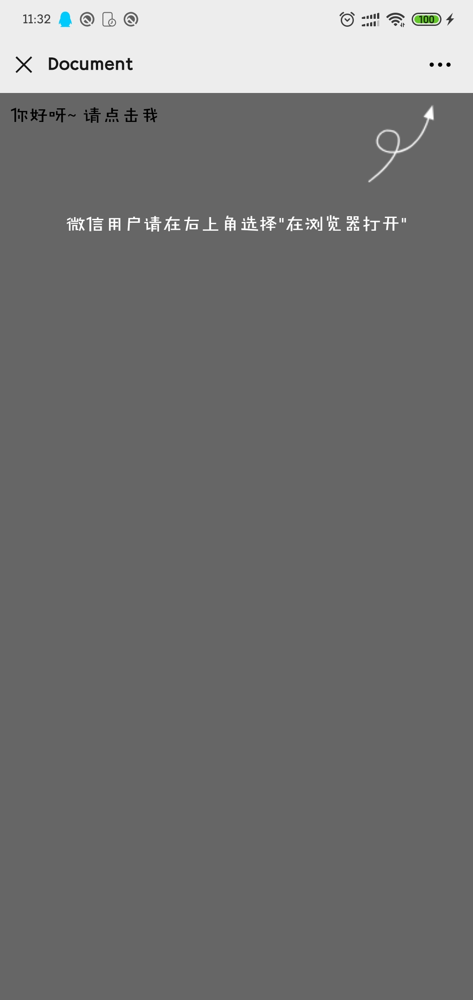

### 卧槽微信浏览器遮罩

&nbsp;&nbsp;&nbsp;&nbsp;做这个的起因是因为业务中经常遇到分享页面到微信，但微信不给用`scheme`导致无法在微信中唤起app。

所以需要做一个遮罩， 通过`user-agent`判断用户在微信中打开， 引导用户用浏览器打开。

经常用到， 写也不麻烦， 就有些浪费时间。 所以干脆封装个js


### 效果图




### 如何使用

第一步，引入js


```
<script src="./weixin.js"></script>
```

第二步，使用


```
<script>
document.getElementById('download').onclick = function(){
	wocMask()
}
</script>
```

**其他辅助功能**

判断浏览器类型
```
console.log(wocDevice);

{isAndroid: true, isIOS: false, isWechat: false, isQQ: false, isLinux: true}
```